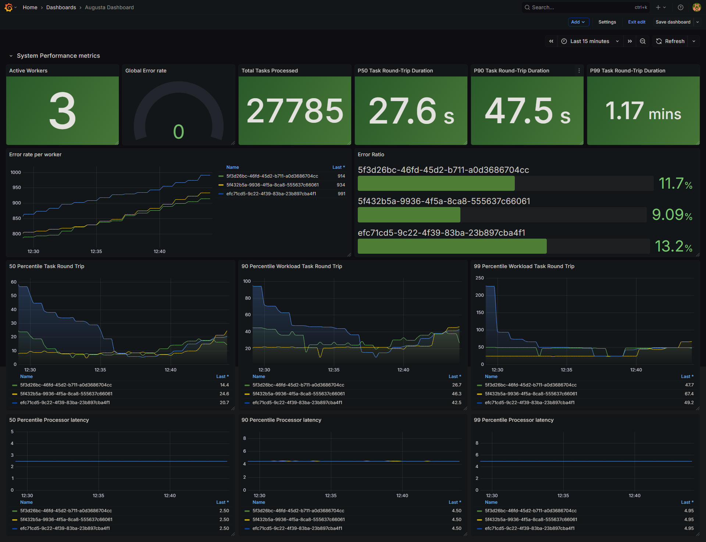
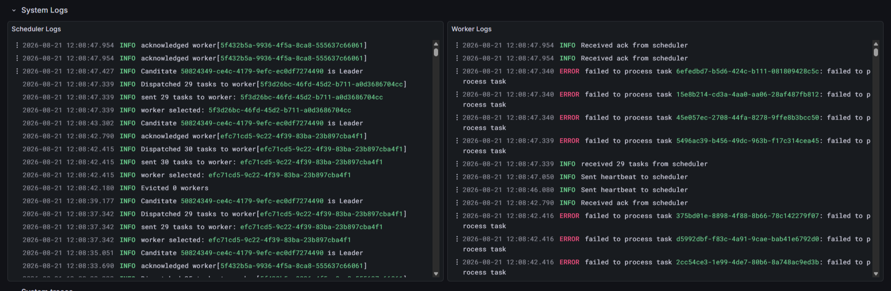
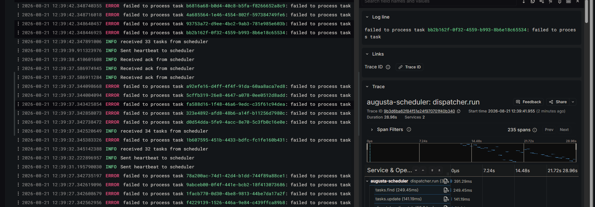
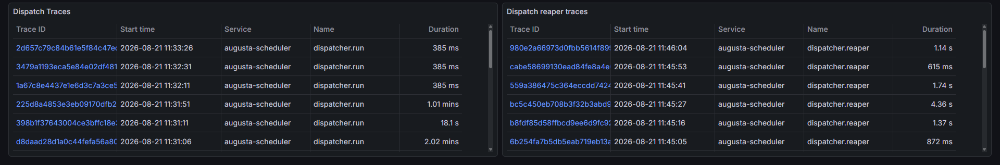
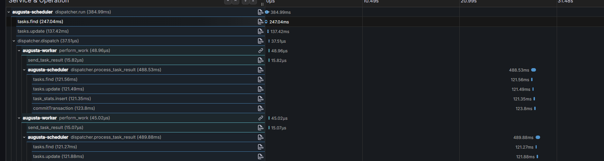
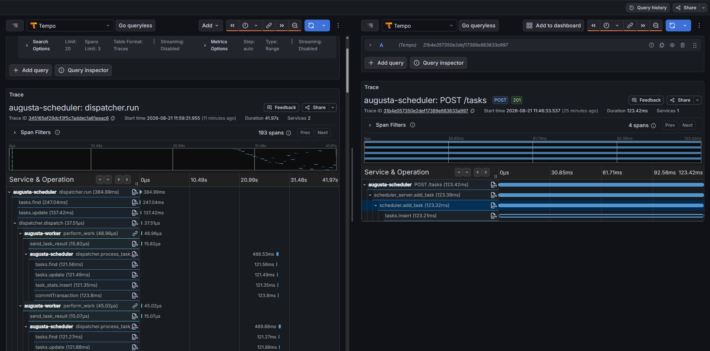
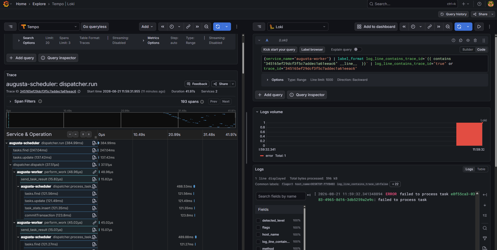

# OTel observability implementation of augusta scheduler

The following is a discussion of the implementation of an observability solution for [augusta scheduler](https://github.com/knightfall22/augusta). Augusta is a distributed task scheduler that works using three layers; control plane, communication layer, and data layer. The overview of the scheduler architecture can be found [here](https://github.com/knightfall22/augusta/blob/main/Architecture.md), but a basic understanding of distributed system is enough to understand this implementation.

This implementation was carried out using the [OpenTelemetry](https://opentelemetry.io/) framework. The system observes three instrumentaions: logs(using logrus and loki), metrics(using prometheus) and trace(using tempo).

### Metrics

Several system metrics are observed:

- Active workers
- Total tasks processed
- Task round trips duration(P50, P90, P99): the time it took from the scheduler to dispatch a task to a worker and back
- Processor latency(P50, P90, P99): the time it took for a worker to process a task

### Logs

General system logs are collected from both the scheduler and workers. Some logs are linked with traces to give a fuller picture of what is going on in the system.

### Traces

Since this is a distributed system tracing is alot more tricky to implement. I performed auto intrumentation on the HTTP and MongoDB, and implemented custom tracing. The most important component of the system the the dispatcher. Which is a module of the scheduler reponsible for distributing tasks to workers, processing task result and retrying failed tasks.

I implemented custom tracing that records the flow from the scheduler to the worker, then the worker to the scheduler. I also observed the "reaper" which is background process that retries tasks that fail to schedule. Traces are linked with with their inception context, which is the context of the HTTP request that scheduled the task, as well as logs.

#### Trace from dispatcher to worker

